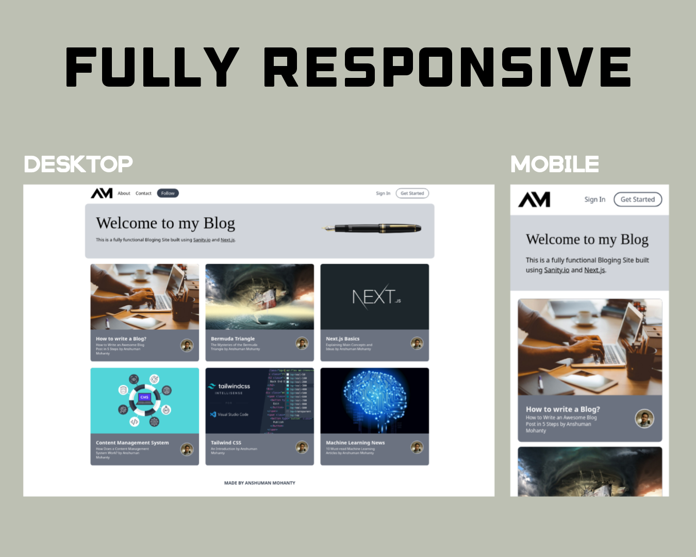

<p align="center">
  <a>
    
    <h1 align="center">Personal Blogging Website using <a href="https://nextjs.org/">Next.js</a> and <a href="https://www.sanity.io/">Sanity.io</a></h1>
  </a>
</p>

>Inspired from [Medium.com](https://medium.com/). This Website is built using Next.js with TailwindCSS and Sanity.io as my CMS(Content Management System).</br></br>

# Fully Responsive Website




## Deploy your own

You can deploy the above website using [Vercel](https://vercel.com?utm_source=github&utm_medium=readme&utm_campaign=next-example):

[](https://vercel.com/new/git/external?repository-url=https://github.com/vercel/next.js/tree/canary/examples/with-tailwindcss&project-name=with-tailwindcss&repository-name=with-tailwindcss)

## How to use

Execute [`create-next-app`](https://github.com/vercel/next.js/tree/canary/packages/create-next-app) with [npm](https://docs.npmjs.com/cli/init) or [Yarn](https://yarnpkg.com/lang/en/docs/cli/create/) to bootstrap the example:

```bash
npx create-next-app --example with-tailwindcss with-tailwindcss-app
# or
yarn create next-app --example with-tailwindcss with-tailwindcss-app
```

Deploy it to the cloud with [Vercel](https://vercel.com/new?utm_source=github&utm_medium=readme&utm_campaign=next-example) ([Documentation](https://nextjs.org/docs/deployment)).
